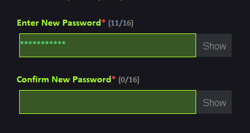

# Remotely Assistant Workers (RAW)

| WELCOME TO RAW(REMOTELY ASSISTANT WORKERS) |

 ---------------
| Introduction |
 ---------------

Remotely Assistant Workers or "RAW" was built with a view to reduce the unemployment problem, increase the platform for remotely working. It is Graphical User Interface(GUI) based system, built with complete Java. The project is completed with basic features of RAW users. The features of Seller, Buyer and Admin access will be updated in the next version of RAW. Stay tuned with us to get those special features.

Thank you everyone.

>> YouTube video link: https://youtu.be/AuJNB6E_LVY

-------------------
| Required System |
-------------------

 >> Any version of windows operating system which is compatible to run Notepad++.
 
 >> Nodepad++
 
 >> XAMPP
 
 >> MySQL server
 
 >> Java Development Kit(JDK) Version 8

--------------------------
| Minimum Specifications |
--------------------------

    1. Operating System : Windows® 7/8/10/11
    2. Processor	: Intel® Core™ i3
    3. Memory		: 1 GB RAM
    4. Graphics		: Not Required
    5. Network		: Broadband Internet Connection
    6. Storage		: 500 MB

-------------------------------------------------
| How to run [Using Command Prompt] |
-------------------------------------------------

 >> Open xampp controle panel and start the actions of "Apache" and "MySQL" module.
 
 >> Click on the "Admin" option of "MySQL" module.
 
 >> This will redirect to "phpMyAdmin" server tool.
 
 >> Click on "SQL" button and paste the sql command "CREATE DATABASE RAW".
 
 >> Click on "go" button and a database nammed "RAW" will be created.
 
 >> Call command prompt from your device and go to "Remotely Assistant Workers (RAW)" folder.
 
 >> Paste these statements "javac -cp .;Resources/External_Jar/*; start.java
                            java -cp .;Resources/External_Jar/*; start".
			    
 >> Press enter and wait for the application to open.
 
 >> Command promt will open the application for RAW(Remotely Assistant Workers).
 
 >> The system will be ready to use.

---------------------------
| How to run [Using .bat] |
---------------------------

 >> Open xampp controle panel and start the actions of "Apache" and "MySQL" module.
 
 >> Click on the "Admin" option of "MySQL" module.
 
 >> This will redirect to "phpMyAdmin" server tool.
 
 >> Click on "SQL" button and paste the sql command "CREATE DATABASE RAW".
 
 >> Click on "go" button and a database nammed "RAW" will be created.
 
 >> Open "Remotely Assistant Workers (RAW)" folder.
 
 >> Open "start.bat" from folder.
 
 >> After opening, you are welcome to use RAW.

--------------------
| How to use "RAW" |
--------------------

	 1. First, make sure your console box is in the full screen and font size is '20'.
	 2. To get access to the administrative permissions, administrator Username: admin and Password: admin. 
	 3. If you are looking for people to get work done, make sure you have signed up as a "Buyer".
	 4. You can get various categories of work by signing up as a "Seller".
	 5. When signing up in the system your input name must be a string type.
	 6. For entering email, a valid email is required.
	 7. To verify yourself you must enter the OTP after confirming the password.
	 8. For mobile number, you have to give a valid mobile number. 
	 9. You must fill all the required field.
	 10. The generated account no of your account must be noted for further purposes.
	 11. In case of forgeting password, you will get a mail on your valid mail address to get the OTP to verify yourself.
	 12. There are 3 different users: Admin, Seller & Buyer.

   Admin :
   
           1. Job Details                  - This feature will be available from next version of RAW.
           2. User Details                 - This feature will be available from next version of RAW.
           3. Ban User                     - This feature will be available from next version of RAW.
           4. User Reports                 - This feature will be available from next version of RAW.
           5. Contact Requests             - This feature will be available from next version of RAW.
           6. Raw Feedbacks                - This feature will be available from next version of RAW.
           7. User Account Details         - This feature will be available from next version of RAW.
           8. Messages                     - This feature will be available from next version of RAW.
           9. Mailbox                      - This feature will be available from next version of RAW.  
          10. Others                       - This feature will be available from next version of RAW.	  

   Seller :

	   1. Search                       - This feature will be available from next version of RAW.
           2. Job Post                     - This feature will be available from next version of RAW.
           3. Working Details              - This feature will be available from next version of RAW.
           4. Past Projects                - This feature will be available from next version of RAW.
           5. Rejected Works               - This feature will be available from next version of RAW.
           6. Message                      - This feature will be available from next version of RAW.
           7. Mail Box                     - This feature will be available from next version of RAW.
           8. Account Details              - This feature will be available from next version of RAW.
           9. Gig                          - This feature will be available from next version of RAW.  
          10. Other tools                  - This feature will be available from next version of RAW.
	   
   Buyer :

	   1. Search                       - This feature will be available from next version of RAW.
           2. Job Post                     - This feature will be available from next version of RAW.
           3. Working Details              - This feature will be available from next version of RAW.
           4. Past Projects                - This feature will be available from next version of RAW.
           5. Reject Work/Workers          - This feature will be available from next version of RAW.
           6. Message                      - This feature will be available from next version of RAW.
           7. Mail Box                     - This feature will be available from next version of RAW.
           8. Account Details              - This feature will be available from next version of RAW.
           9. Gig                          - This feature will be available from next version of RAW.  
          10. Other tools                  - This feature will be available from next version of RAW.

 >> There are some other options for RAW Users.

   User Options:

           1. About RAW                    - This will give a small view of RAW and a short description of the developers.
           2. Contact Us                   - User can contact to admin for any issue.
           3. Feedback                     - Feedback will help to improve the system and serve the user better.
           4. Report                       - If user faces any problem using the system, reporting will help.

---------------------------
| Background Informations |
---------------------------

At present time unemployment problem is a big problem. The recent world is very digitalized and commercial. In that commercial world to find a better rhythm between their carrier and life goals most people want to be a freelancer.

Freelancing is basically a platform where a user can find remote work from other users. They can communicate with each other for a better understanding of the work. Users can do any task from anywhere, anytime. Basically, it is a great source for earning money for those who know what to 
do and how to do it.
 
From this point onward, the system is going to be introduced here is "Remotely Assistant Workers" or "RAW" in short. Through this system evaluation of remote work is much more easier and effective.

----------------------------
| Developer's Informations |
----------------------------

	 1. Niloy Kanti Paul
	    Email	: niloykantipaul@gmail.com
	    LinkedIn	: https://www.linkedin.com/in/niloy-kanti-paul-5543181ab/
	    Github	: https://github.com/DEV-NKP

	 2. Kaushik Biswas
	    Email	: biswaskaushik.2020@gmail.com
	    LinkedIn	: https://www.linkedin.com/in/kaushik-biswas-2b6554243/
	    Github	: https://github.com/Kaushik-Biswas

	 3. Dipanwita Saha
            Email	: dipanwitasaha7009@gmail.com
	    LinkedIn	: https://www.linkedin.com/in/dipanwita-saha-a772aa215/
	    Github	: https://github.com/Dipanwita-Saha

----------------------
| Project Highlights |
----------------------

> The Raw's home page has three sections for the convenience of the users - Sign Up, Log In and Admin Access. It is designed in a properly structured way so that you can find the options easily.

> RAW has a Remember Me option to reduce log in suffering.

> You can choose your preferred method as per your convenience to contact with Admin.

> There are three options if a User reports about the software, user, or account so that the user can give more detail about the report's reason.

> To report user raw gives options for the reporter that make it easy to describe the reason briefly.

> In every input section, the total letter is counted at the top so that the user can see the character limit of each section.

> A valid mobile number is only granted in the system. For every input of an invalid phone number, a warning is given there.

> Including 260 countries flag and country code is provided with each country's name to choose the country code of the user's phone number.

> By giving the required message it is made clear to the user which input section is required and which is not.

> At the time of signing up and changing the password, a one-time password will be sent to your mail to verify the User.

> A 16-digit unique account no is generated in every sign-up of Buyers and Seller.

> Every inputted email is checked with the email validation system and database.

> In every password confirmation, the password is inputted two times that ensures security and provides an errorless facility.

> User skills are shown in a user-friendly way in RAW. Which is easy to add and remove with a single click.

> RAW has a unique and colorful designed logo.

********************************************ⒸAll Rights Reserved By "TEAM_RAW"********************************************

